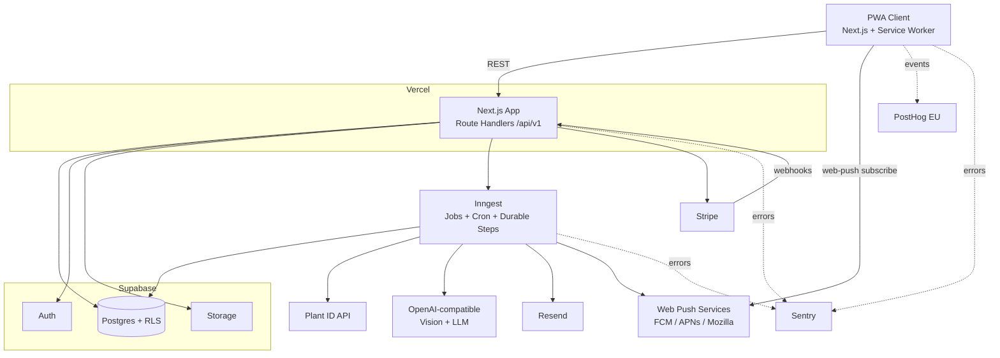
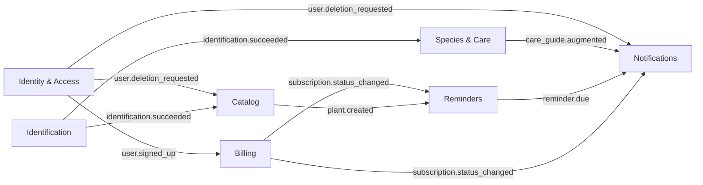
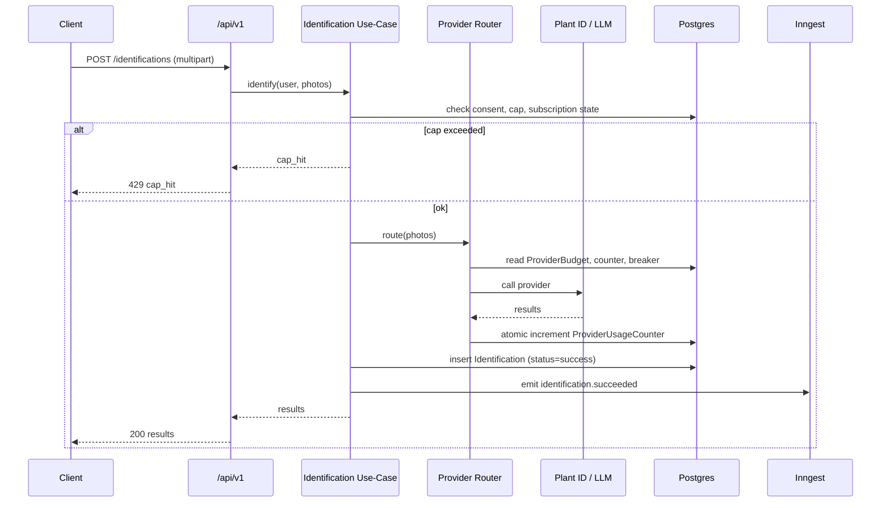
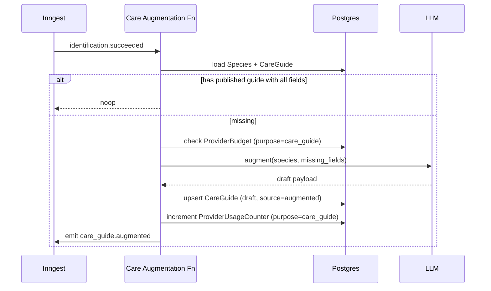
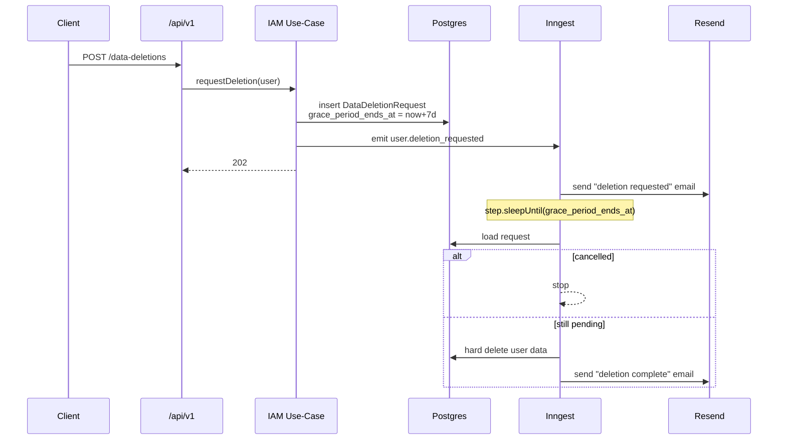
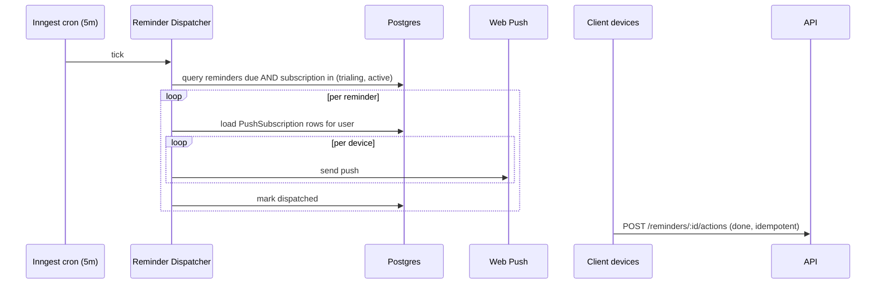

# Folhário — High-Level Design

**Version:** 1.0
**Date:** 2026-04-12
**Status:** Draft

Companion to [`PRD-V1.1.md`](./PRD-V1.1.md) and [`API-CONTRACT.md`](./API-CONTRACT.md).

- **PRD** — what is built.
- **API-CONTRACT** — how clients talk to it.
- **This document** — how it runs: bounded contexts, infrastructure, external services, CI/CD.

Audience: engineers implementing the MVP. Assumes familiarity with Next.js, Supabase, DDD, and the PRD.

---

## 1. Tech Stack

| Layer | Choice | Notes |
|---|---|---|
| Frontend | Next.js (App Router) + React + TypeScript | PWA via service worker + web app manifest |
| Backend | Next.js Route Handlers under `/api/v1` | Same deployment as the frontend |
| Data access | Drizzle ORM | Queries live inside repositories only (§5.2 PRD) |
| Database | Supabase Postgres via Supavisor pooler (transaction mode) | RLS enabled as defense in depth |
| Auth | Supabase Auth (behind adapter) | JWT verified in middleware |
| Storage | Supabase Storage (behind adapter) | Signed URLs |
| Async runtime | Inngest | Event-driven + cron + durable `step.sleepUntil` |
| Transactional email | Resend | React Email templates |
| Error tracking | Sentry | Next.js SDK + source maps uploaded from CI |
| Product analytics | PostHog (EU cloud) | Event taxonomy mirrors §8 PRD metrics |
| Push | `web-push` + VAPID | Dispatched from Inngest functions |
| Hosting | Vercel | Deploys from GitHub Actions only (git integration disabled) |
| Testing | Vitest + Playwright | Real Postgres for integration (§4.11 PRD) |
| CI/CD | GitHub Actions | See §8 |

Framework/library versions are deferred to implementation (§5.6 PRD).

---

## 2. System Context



---

## 3. Bounded Contexts

Each context owns its aggregates and is the only writer for them. Cross-context communication is via Inngest events for async work, or thin read-only query services for synchronous reads.



| Context | Aggregates | Emits | Consumes | External deps |
|---|---|---|---|---|
| **Identity & Access** | `User`, `ConsentLog`, `PartnerStore`, `DataExportRequest`, `DataDeletionRequest` | `user.signed_up`, `user.consent_granted`, `user.consent_revoked`, `user.deletion_requested`, `user.deleted`, `data_export.requested` | `subscription.status_changed` | Supabase Auth, Resend |
| **Catalog** | `Plant`, `PhotoEntry` | `plant.created`, `plant.deleted` | `user.deletion_requested`, `identification.succeeded` | Supabase Storage |
| **Species & Care** | `Species`, `CareGuide`, `SpeciesFlag` | `care_guide.augmented`, `care_guide.published` | `identification.succeeded` | LLM (augmentation) |
| **Identification** | `Identification`, `ProviderBudget`, `ProviderUsageCounter`, `IdentificationLimit` | `identification.succeeded`, `identification.failed`, `provider.ceiling_reached` | `user.consent_granted` | Plant ID, LLM |
| **Reminders** | `Reminder`, `ReminderLog` | `reminder.due`, `reminder.completed` | `plant.created`, `plant.deleted`, `subscription.status_changed` | — |
| **Billing** | `Subscription`, `BillingEvent` | `subscription.status_changed`, `payment.failed`, `trial.ending` | `user.signed_up` | Stripe |
| **Notifications** | `PushSubscription` (+ stateless email dispatch) | `notification.sent`, `notification.failed` | `reminder.due`, `care_guide.augmented`, `subscription.status_changed`, `user.deletion_requested`, `user.deleted`, `data_export.requested`, `payment.failed`, `trial.ending` | Resend, Web Push |

**Repository layout:**

```
src/
  contexts/
    iam/              # domain / application / infrastructure / api / inngest
    catalog/
    species-care/
    identification/
    reminders/
    billing/
    notifications/
  shared/
    db/               # drizzle schema, migrations
    events/           # event bus abstraction over Inngest
    adapters/         # storage, push, llm client interfaces
    config/
    telemetry/        # sentry, posthog init
```

Each context follows: `domain/` (aggregates + domain events), `application/` (use-cases), `infrastructure/` (repositories, external adapters), `api/` (route handlers), `inngest/` (event-driven functions). Route handlers are thin — they validate, delegate to a use-case, map the result to an HTTP response. No Drizzle calls in handlers.

---

## 4. Key Flows

### 4.1 Identification



Augmentation runs off `identification.succeeded` inside the Species & Care context:



The budget and counter reads/writes above hit `ProviderBudget` and `ProviderUsageCounter` rows keyed by `(provider, purpose=care_guide)` — a separate row from the identification budget for the same provider (PRD §4.8 scope note, §3.3.7). Exhausting this budget pauses augmentation without affecting identification.

### 4.2 Account deletion (7-day grace)



Inngest's durable `step.sleepUntil` removes the need for a cron scanning for expired grace periods.

### 4.3 Reminder fire-out



Offline "done" actions ride the §4.4 PRD sync queue.

---

## 5. External Services

### 5.1 Vercel

- **Purpose:** hosts the Next.js app (frontend + API routes).
- **Config:** one project; production + preview domains; **git integration disabled**. All deploys run from GitHub Actions (§8).
- **Function limits:** route handlers ≤60s; anything longer runs in Inngest. Identification handlers operate under an explicit budget: **total wall-clock 50s**, with each provider call capped at **30s**. The router attempts the next fallback provider only if the remaining budget is ≥ 10s; otherwise the request short-circuits with `provider_unavailable` and the client retries. A per-call timeout is treated as a provider failure for circuit-breaker purposes (§4.8.3 PRD). Rationale: a 50s ceiling leaves ~10s slack under the 60s platform cap for request parsing, image upload buffering, and response shaping.
- **Local dev:** `next dev`. Vercel CLI is used only in CI.
- **Secrets:** all runtime env vars stored as Vercel Project Environment Variables, scoped per environment.

### 5.2 Supabase

- **Purpose:** Postgres, Auth, Storage.
- **Config:** one project per environment. Postgres accessed via Supavisor pooler in transaction mode. RLS enabled on all user-owned tables as defense in depth; app-layer repositories are the primary enforcement.
- **Storage buckets:** `plant-photos`, `plant-thumbnails`, `data-exports` (all private, signed-URL access).
- **Migrations:** `supabase/migrations/` versioned in the repo; applied in CI.
- **Local dev:** `supabase start` (Docker) — local Postgres, Auth, Storage, Studio. `supabase db reset` to rebuild from migrations + seed.
- **Secrets:** `SUPABASE_URL`, `SUPABASE_ANON_KEY`, `SUPABASE_SERVICE_ROLE_KEY`, `DATABASE_URL` (direct, for migrations), `DATABASE_POOL_URL` (runtime via Supavisor).

### 5.3 Inngest

- **Purpose:** async jobs, cron, durable workflows.
- **Config:** one Inngest app per environment. Functions registered via the Next.js adapter at `/api/inngest`.
- **Functions (MVP):**
  - `care-guide/augment` — on `identification.succeeded`
  - `iam/process-deletion` — on `user.deletion_requested` (uses `step.sleepUntil`)
  - `iam/generate-export` — on `data_export.requested`
  - `billing/process-webhook` — on `billing.webhook.received` (idempotent on `event_id`)
  - `billing/trial-ending-notifier` — daily cron, emits `trial.ending` at T-3d and T-1d
  - `reminders/dispatch` — cron every 5 minutes
  - `notifications/send-email` — on any email-triggering event
  - `notifications/send-push` — on `reminder.due`
- **Local dev:** `npx inngest-cli dev`.
- **Secrets:** `INNGEST_EVENT_KEY`, `INNGEST_SIGNING_KEY`.

### 5.4 Stripe

- **Purpose:** subscription billing, Pix + card, dunning.
- **Config:**
  - Test + live modes; live enabled only after §0 pricing blocker resolves.
  - One product (`folhario_monthly`), one price (TBD, BRL).
  - Payment methods: card + Pix.
  - Dunning: 4 retries over 7 days (§4.7.4 PRD).
  - Webhook endpoint `POST /api/v1/webhooks/stripe`. The handler performs three steps **synchronously** before returning 200: (1) verify signature, (2) insert a `BillingEvent` row with a unique constraint on `event_id` — a constraint violation is the dedup signal and returns 200 as a no-op, (3) enqueue `billing.webhook.received` to Inngest for heavy processing. Any failure in (1)–(3) returns a non-2xx so Stripe retries. Offloading (3) to Inngest keeps the 200 fast while guaranteeing idempotency is decided at ingest, not inside the async worker.
- **Local dev:** `stripe listen --forward-to localhost:3000/api/v1/webhooks/stripe`.
- **Secrets:** `STRIPE_SECRET_KEY`, `STRIPE_WEBHOOK_SECRET`, `STRIPE_PRICE_ID`.

### 5.5 Resend

- **Purpose:** transactional email.
- **Config:** verified sending domain (DKIM + SPF + DMARC); React Email templates in source.
- **Triggers (MVP):**

| Trigger | PRD ref |
|---|---|
| Email verification at signup | §4.2 |
| Password reset | §4.2 |
| Trial ending (T-3d, T-1d) | §4.7 |
| Trial expired | §4.7.2 |
| Payment failed (dunning 1–4) | §4.7.4 |
| Subscription canceled | §4.7.6 |
| Reactivation confirmation | §4.7.6 |
| Account deletion requested (grace start) | §4.6.3 |
| Account deletion completed | §4.6.3 |
| Data export ready | §4.6.2 |
| 80% provider cost ceiling (operator alert) | §4.8.2 |

- **Secrets:** `RESEND_API_KEY`, `RESEND_FROM_ADDRESS`.

### 5.6 Sentry

- **Purpose:** error tracking and performance tracing for Next.js (client + server) and Inngest functions.
- **Config:** one Sentry project; environments `production` / `preview` / `development`. Source maps uploaded from GitHub Actions on production deploys; release tag = git SHA.
- **PII scrubbing (LGPD):** strip `Authorization`, `Cookie`, any field matching `email|password|token|photo_url`; drop request bodies on identification routes (photos). Users must not appear in breadcrumbs by email.
- **Secrets:** `SENTRY_DSN`, `SENTRY_AUTH_TOKEN` (CI), `SENTRY_ORG`, `SENTRY_PROJECT`.

### 5.7 PostHog

- **Purpose:** product analytics — funnels, cohorts, retention. Source of truth for §8.1 PRD product metrics.
- **Config:** **EU cloud** (`eu.posthog.com`) for LGPD posture. Client-side JS SDK (consent-gated) plus server-side events for lifecycle events without a client touch.
- **Event taxonomy (seed):** `signup_completed`, `consent_granted`, `identification_started`, `identification_succeeded`, `identification_cap_hit`, `plant_added`, `reminder_created`, `reminder_acted`, `care_guide_viewed`, `trial_started`, `subscription_activated`, `subscription_canceled`, `data_export_requested`, `data_deletion_requested`. Each event maps to at least one metric in §8 PRD.
- **Secrets:** `POSTHOG_API_KEY`, `POSTHOG_HOST=https://eu.posthog.com`.

### 5.8 Plant ID API

- **Purpose:** primary identification provider.
- **Config:** API key; spend governed by `ProviderBudget` (§4.8.2 PRD) and circuit breaker (§4.8.3 PRD).
- **Local dev:** stub returning fixture data; real calls gated behind `IDENTIFICATION_PROVIDER_MODE=real` to avoid accidental spend.
- **Secrets:** `PLANTID_API_KEY`.

### 5.9 OpenAI-compatible provider

- **Purpose:** secondary identification provider and `CareGuideProvider` for augmentation.
- **Config:** base URL + API key + model ID configurable per environment (supports OpenAI, Anthropic, or local models behind compatible endpoints). Prompts live in source and are versioned with the app (§3.1.5, §5.5 PRD).
- **Local dev:** stub by default; real calls opt-in.
- **Secrets:** `LLM_API_KEY`, `LLM_BASE_URL`, `LLM_MODEL`.

### 5.10 Web Push / VAPID

- **Purpose:** PWA push notifications.
- **Config:** VAPID key pair generated once per environment, stored as env vars. Public key exposed to the client for subscription; private key used server-side by `web-push`. Key rotation invalidates all existing `PushSubscription` rows — deferred.
- **Secrets:** `VAPID_PUBLIC_KEY`, `VAPID_PRIVATE_KEY`, `VAPID_SUBJECT` (mailto).

---

## 6. Environments

| | Local | Preview | Production |
|---|---|---|---|
| Host | `next dev` | Vercel Preview | Vercel Production |
| DB / Auth / Storage | `supabase start` (Docker) | Supabase branch DB per PR | Supabase production |
| Inngest | Inngest Dev Server | Inngest preview env | Inngest production env |
| Stripe | Stripe CLI, test mode | Stripe test mode | Stripe live mode |
| Resend | Sandbox domain | Sandbox | Verified domain |
| Sentry | disabled | `preview` env | `production` env |
| PostHog | disabled | dev project | production project |
| Identification / LLM providers | stubs (default) | stubs; real via flag | real |

Preview environments are created by GitHub Actions on PR open and torn down on PR close.

---

## 7. Environment Variables

| Name | Service | Scope | Notes |
|---|---|---|---|
| `DATABASE_URL` | Supabase | all | Direct connection, migrations only |
| `DATABASE_POOL_URL` | Supabase | all | Supavisor transaction mode, runtime |
| `SUPABASE_URL` | Supabase | all | |
| `SUPABASE_ANON_KEY` | Supabase | all | Public |
| `SUPABASE_SERVICE_ROLE_KEY` | Supabase | server | Bypasses RLS |
| `INNGEST_EVENT_KEY` | Inngest | all | |
| `INNGEST_SIGNING_KEY` | Inngest | server | |
| `STRIPE_SECRET_KEY` | Stripe | server | |
| `STRIPE_WEBHOOK_SECRET` | Stripe | server | |
| `STRIPE_PRICE_ID` | Stripe | all | |
| `RESEND_API_KEY` | Resend | server | |
| `RESEND_FROM_ADDRESS` | Resend | all | |
| `SENTRY_DSN` | Sentry | all | |
| `SENTRY_AUTH_TOKEN` | Sentry | CI | Source map upload |
| `SENTRY_ORG` / `SENTRY_PROJECT` | Sentry | CI | |
| `POSTHOG_API_KEY` | PostHog | all | |
| `POSTHOG_HOST` | PostHog | all | `https://eu.posthog.com` |
| `PLANTID_API_KEY` | Plant ID | server | |
| `LLM_API_KEY` / `LLM_BASE_URL` / `LLM_MODEL` | LLM | server | |
| `VAPID_PUBLIC_KEY` | Web Push | all | |
| `VAPID_PRIVATE_KEY` | Web Push | server | |
| `VAPID_SUBJECT` | Web Push | server | |
| `IDENTIFICATION_PROVIDER_MODE` | App | all | `stub` \| `real` |
| `VERCEL_TOKEN` / `VERCEL_ORG_ID` / `VERCEL_PROJECT_ID` | Vercel | CI | Deploy |
| `SUPABASE_ACCESS_TOKEN` / `SUPABASE_PROJECT_REF` | Supabase | CI | Migrations |

Runtime vars live in Vercel Project Environment Variables per environment. CI-only vars live in GitHub Actions repository secrets.

---

## 8. CI/CD — GitHub Actions

Vercel git integration is **disabled**; every deploy runs from GitHub Actions so tests, migrations, and deploys share one pipeline.

**Workflows:**

- **`ci.yml`** (on PR + push to `main`):
  - Install, lint, typecheck
  - Unit tests (Vitest)
  - Integration tests against a real Postgres service container (`postgres:16`), migrations applied, fixtures seeded (§4.11 PRD)
  - Build

- **`deploy-preview.yml`** (on PR open/sync):
  - Depends on `ci.yml`
  - Apply migrations to the Supabase branch DB for this PR
  - `vercel pull` for preview env, `vercel build`, `vercel deploy --prebuilt`
  - Run Playwright against the returned preview URL
  - Comment the preview URL on the PR

- **`deploy-production.yml`** (on push to `main`):
  - Depends on `ci.yml`
  - Apply migrations to production Supabase (manual approval gate for destructive changes)
  - `vercel pull` for production env, `vercel build --prod`, `vercel deploy --prebuilt --prod`
  - Create Sentry release and upload source maps
  - Sync Inngest functions

**Cleanup:** `deploy-preview-cleanup.yml` on PR close — delete Supabase branch DB, remove Vercel preview alias.

**Required GitHub secrets:** `VERCEL_TOKEN`, `VERCEL_ORG_ID`, `VERCEL_PROJECT_ID`, `SUPABASE_ACCESS_TOKEN`, `SUPABASE_PROJECT_REF`, `SENTRY_AUTH_TOKEN`, `INNGEST_SIGNING_KEY`, plus runtime secrets needed by integration tests.

Playwright runs against the preview URL in CI, not a local dev server — exercises the real serverless build.

---

## 9. Observability

- **Errors + traces:** Sentry. All unhandled exceptions (client, server, Inngest) report with release tag = git SHA.
- **Product metrics (§8.1 PRD):** PostHog. Event taxonomy in §5.7.
- **Identification quality metrics (§8.2 PRD):** sourced from the `Identification` table via scheduled SQL rollups (Inngest cron), surfaced in Supabase dashboards.
- **Infra metrics:** Vercel (HTTP), Inngest dashboard (jobs), Supabase dashboard (DB).
- **Alert routing:**
  - Sentry → email/Slack on new issues and error-rate spikes.
  - 80% provider cost ceiling (§4.8.2 PRD) → Resend operator email.
  - Stripe webhook signature failure → Sentry (critical) + operator email.
  - Inngest function failure after retries exhausted → Sentry.

---

## 10. Security Checklist

- JWT verified in middleware on every `/api/v1/*` request except public endpoints defined in `API-CONTRACT.md §1`.
- Stripe webhook signature verified on every request; failures return `webhook_signature_invalid` and page to Sentry.
- Image EXIF stripped client-side before upload (§4.5 PRD); server rejects images still carrying GPS tags as defense in depth.
- RLS enabled on all user-owned tables; service role key used only server-side, never exposed to the client.
- Secrets live only in Vercel Environment Variables and GitHub Actions repository secrets. Never committed, never logged.
- Sentry breadcrumbs scrub `Authorization`, `Cookie`, `email`, `password`, `photo_url`; identification route bodies are dropped entirely.
- Standard security headers (CSP, HSTS, X-Frame-Options, Referrer-Policy) set via Next.js middleware.
- Rate limiting is app-layer only in MVP (§3 API-CONTRACT).
- DPO contact info published per §4.6.7 PRD (blocker — §0).

---

## 11. Open Infrastructure Questions

1. **Supabase preview branching cost:** branch DB per PR is cleanest but scales with PR volume; a single shared preview project is the fallback.
2. **Inngest durable-step budget:** `step.sleepUntil(7d)` consumes step budget; monitor on launch against the free tier.
3. **Sentry trace sampling:** start at 10%, tune after launch.
4. **PostHog session replay:** off in MVP; revisit once product metrics stabilize.
5. **Image CDN:** Supabase Storage ships with its own CDN; whether to layer Vercel Image Optimization on top is TBD.
6. **Backup retention alignment:** Supabase's default backup window must be verified against the §4.6.3 PRD "≤30-day backup propagation" commitment; adjust if needed.
